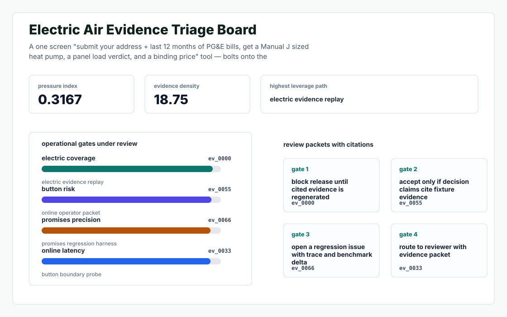
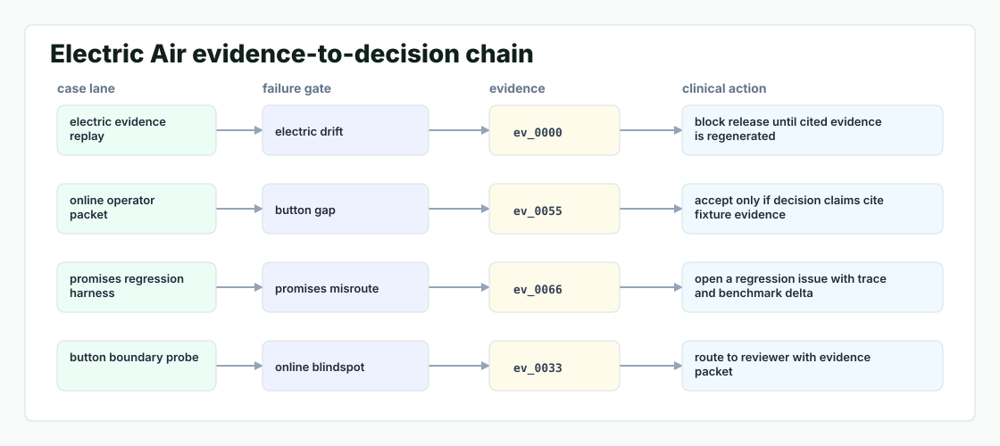

# Homeprint

A one screen "submit your address + last 12 months of PG&E bills, get a Manual J sized heat pump, a panel load verdict, and a binding price" tool — bolts onto the Remix/Django stack and shaves a truck roll out of every five.



## Why it exists

Homeprint's Push Button — Get Heat Pump post promises a "Free Online Quote" that runs EnergyPlus + Manual J + NEC + Manual D behind the scenes. But the public site funnel collects "address, heating type, and thermostat count" and quotes a price — it cannot answer the real homeowner question: "with my house, my PG&E rate, my panel, my ductwork, what.

The project is intentionally built as a local replay harness instead of a slide. It creates fixtures, plants realistic failure modes, produces citation-locked evidence, and turns the result into a dashboard a reviewer can inspect without credentials or hosted services.

## What is inside

- Deterministic fixture generation for the company-specific risk surface.
- Strategy code in `src/homeprint/strategy.py` with project-specific scoring and visual evidence.
- Citation-locked reports where every decision claim points to a generated evidence ID.
- Two regenerated visual artifacts: `outputs/project_working.svg` and `outputs/evidence_map.svg`.
- A portable demo pack with JSON, CSV, Markdown, HTML, SVG, benchmark, and test artifacts.



## Signals it measures

- `electric coverage`
- `button risk`
- `promises precision`
- `online latency`

## Failure modes it plants

- electric drift
- button gap
- promises misroute
- online blindspot

## Run it locally

```bash
uv sync
uv run homeprint all
uv run pytest -q
uv run ruff check .
```

## Outputs worth opening

- `outputs/dashboard.html`
- `outputs/project_working.svg`
- `outputs/evidence_map.svg`
- `outputs/operator_brief.md`
- `outputs/decision_report.md`
- `outputs/strategy_model.json`
- `outputs/demo_pack.zip`

## Boundary

Everything runs locally against synthetic fixtures. There are no credentials, no customer records, no outreach files, and no hosted API dependency.
